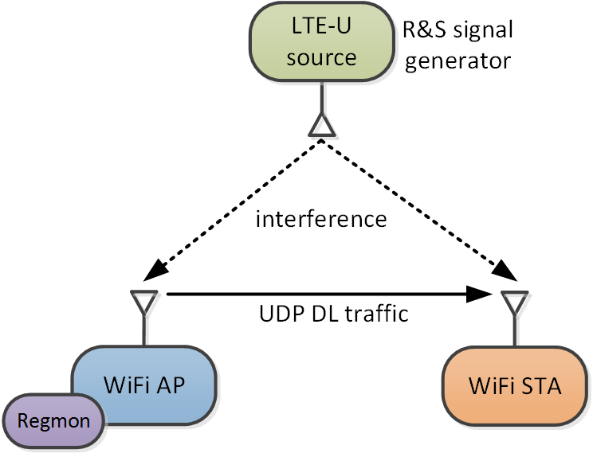

Impact of LTE-U on WiFi
============================

## Experiment setup

The set-up is shown here:

## Traces:

Two measurement campaigns have been performed:

wiplus_dl_lte-fb_20161223

-- LTE with backlogged traffic ,i.e. a full buffer trafficc model is used.

wiplus_dl_lte-vb-rnd9_2016122

-- Variable LTE-U traffic: The setup is as in previous experiment with a fixed duty cycle of 33% but
with variable buffer traffic model, i.e. the LTE-U ON phase was loaded uniform random between 30 % and 100 % which
corresponds to an effective LTE-U duty cycle of 16%.

The measurements of each parameter settings, i.e. different interfering LTE-U signal strengths and duty-cycles, is contained in a folder. 

Each folder contains the following four files:

config.json

- additional parameter settings encoded in JSON, example is given below

iometer.pklz

- TBD.

iperf3.pklz

- UDP downlink throughput measured at the WiFi AP
- Note: the normalized UDP throughput of the WiFi link under LTE-U interference, relative to the non-interfered WiFi link, corresponds
to the effective available medium airtime for the WiFi link.

regmon.pklz

- RegMon data collected at the WiFi AP; see [regmon](https://github.com/thuehn/RegMon) website for more information.

## Scripts:

See tools/read_trace.py

	cd tools
	python3 read_trace.py

The meta data of a particular run can be obtained by calling:

    config_data = cfg.load_config(fname)
    meta_data = cfg.get_meta_data_from_fname(config_data['common']['meas_name'])

Here is an example for the return values.

The first is a json object:

    {   'common': {   'data_dir': '/measurements/wiplus_dl_lte-fb_20161223',
                      'meas_name': 'wifi=11a-5240mhz-15dbm-noani-siso_L2Probe=False_ICMPProbe=False_IPerf=udp-90M-dl=True_lteu=64qam_duty50-on80ms-off80ms-9dbm_RMres=0.50_runt=30',
                      'runtime': 30,
                      'update_interval': 1000.0},
        'icmp': {   'cpu_use': 2,
                    'destination': '192.168.2.2',
                    'enable': False,
                    'interval': 1,
                    'packet_size': 0},
        'iometer': {   'cpu_use': 0,
                       'iface': 'ath0',
                       'result_file': 'iometer.pklz',
                       'sampling_interval': 100.0},
        'iperf3': {   'bandwidth': '90M',
                      'cpu_use': 2,
                      'downlink': True,
                      'enable': True,
                      'result_file': 'iperf3.pklz',
                      'sampling_interval': 100.0,
                      'server': '192.168.2.2'},
        'l2probe': {   'cpu_use': 0,
                       'destination': '64:66:b3:6f:8d:42',
                       'enable': False,
                       'iface': 'mon0',
                       'interval': 1},
        'regmon': {   'cpu_use': 1,
                      'iface': 'ath0',
                      'result_file': 'regmon.pklz',
                      'sampling_interval': 0.5},
        'tcpdump': {'cpu_use': 3, 'iface': 'mon1', 'result_file': 'tcpdump.pcap'}}

Here we see configurations for e.g. Iperf and regmon. The sampling_interval is in milliseconds.

Whereas the second a Python dictionary:

    {   'ICMPProbe': ['False'],
        'IPerf': ['udp', '90M', 'dl', 'True'],
        'L2Probe': ['False'],
        'RMres': ['0.50'],
        'lteu': ['64qam', 'duty50', 'on80ms', 'off80ms', '9dbm'],
        'runt': ['30'],
        'wifi': ['11a', '5240mhz', '15dbm', 'noani', 'siso']}

Here IPerf was using UDP with bitrate of 90M in downlink.
The LTE-U configuration was 64QAM, duty cycle of 50% with a CSAT cycle length of 80+80=160ms, with ON phase of 80ms and LTE-U tx power of 9dBm.
The WiFi configuration was 802.11a, channel 48 (5240MHz), Tx power of 15 dBm, SISO and Atheros ANI disabled.